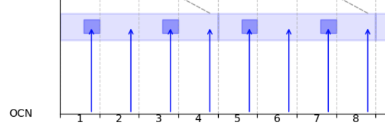
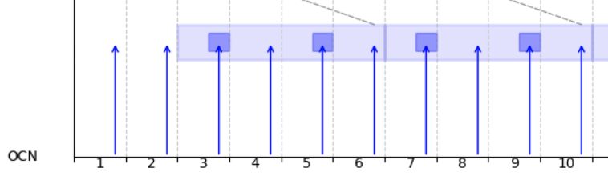
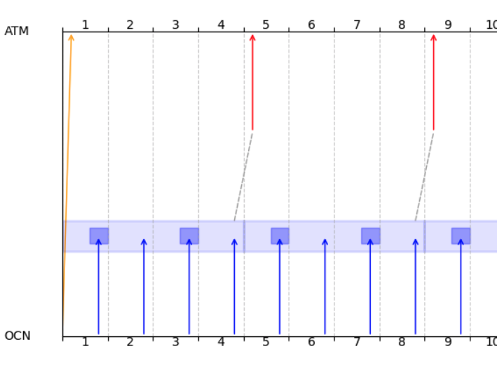

# Brief introduction to XIOS basic functionalities

Before exploring the coupling functionality, it is essential to first understand how XIOS operates for its original purpose. Refer to the XIOS documentation and hands on tutorials first. 

Explainations for this example can be found in the toymodel source file and iodef.xml.

The iodef.xml file contains the parameters and the definitions of the fields, grids and file that we are going to manipulate with XIOS. In this example we will just send a field every timestep from a client to the xios "server", which will then save it in a file. At the same time, fields for each timestep will be loaded from another file and sent to the client.  

# First timing notions
XIOS handles the concept of time in the model through the routine `xios_update_calendar(timestep)`, by which the user can set the current timestep, before performing a `xios_send_field` `xios_recv_field`. 

The timeline of xios is **one indexed**, starting from `@ts=1`.


Indeed, this is the standard in XIOS, but in coupler softwares such as OASIS, we are usually used to index time/timesteps from 0 instead. 

**Time filters** are activated when a field is included into a `<file>` for writing it, or it is reused by another field to save the result of an applied operation. Indeed, the time filter mechanism is implemented to perform operations in time over the fields, for post-processing and I/O (refer to XIOS tutorials for a more detailed intro).

The timing parameters are defined through a set of attributes, which lead to different behaviours depending onto which xml tag are defined. These are:
- output_freq: With this attribute we can define the frequency at which the reading or writing operation is performed when dealing with files, and it is defined only on `<file>` tags.
- freq_op: It is the attribute to define the frequency of the so called "operations" that can be performed on fields using time filters, and it has been extended to coupling functionalities. We found this in `<field>` tags. It can also be used as the "sampling frequency" for integration in a coupling period, but we will se that later. 
- freq_offset: It is the number of timesteps to define a shift from the default starting timestep for the sampling (and so the operation applied to these elements). We found this in `<field>` tags.

# Standard XIOS timestepping 
Here we showcase how we can chain multiple "time filters" to perform fine-grained operations on the field. 
Particularly, we start with no "sampling frequency" on the model data. Basically, we define:
- `operation`: The time operation to apply, placed on the starting field, here `field_2d_send`
- `freq_op`: The frequency at which apply the operation, applied on another field which will store the result, here `field_2d_send_avg`.
- `expr='@this_ref'`: This attribute on the result field means: apply the `operation` with this `freq_op` on the field that it is referenced (here is `field_2d_send`)

At this point, `field_2d_send_avg` is ready to be accessed. We can chain another time filter performing an operation, saving to another field the result or directly from file. For the file, the concept is the same
- `operation`: The time operaiton to apply placed on the starting field `field_2d_send_avg`
- `output_freq`: has the same role of `freq_op`, but for writing the result on file

There is no need to set `expr`, since putting the field in the `<file>` tag already presuppose this is the field to apply the operation on. 

Supposing the values of the fields corresponds to the timesteps, we can see the following example:
> Legend: |--field value in timestep--| 


field_2d_send
> |--1--|--2--|--3--|--4--|--5--|--6--|--7--|--8--|

field_2d_send_avg
> |-----|-1,5-|-----|-3,5-|-----|-5,5-|-----|-7,5-| 

file

> |-----|-----|-----|--5--|-----|-----|-----|-13-|

```xml
  <field_definition>
     <field id="field_2d_send" grid_ref="grid_2D" operation="average"/>
   </field_definition>

   <file_definition>
     <file  name="saved_file" output_freq="4ts" type="one_file">
       <field id="field_2d_send_avg" field_ref="field_2d_send" name="field2D_oce_to_atm" operation="accumulate" freq_op="2ts" expr="@this_ref"/>
     </file>
    </file_definition>
```
# XIOS+Coupling  timestepping 
Let's directly see how it works in the coupler functionality. The concept is essentially the same, with the ending time chain result being specified in the `<coupler_out>` tag instead of `<file>`.

The model send the field to XIOS at a certain timestep:
```fortran
xios_set_calendar(i) 
xios_send_field("field2D_send", field) ! Send field to xios at i-th timestep
```

As before, we define the field label `field2D_send` in the iodef.xml. We can also define on this field the attributes `freq_op` and `freq_offset`, which cuold be used to define the sampling frequency and the offset for the operation applied on the sampled elements (the same concept still applied if we want to save to a file).
```xml
<field_definition>
    <!-- Interface for the model to send a field to XIOS -->
    <!-- sampling frequency, sampling offset and operation to perform here-->
    <field id="field2D_send" grid_ref="grid_2D" freq_op="xxx ts" freq_offset="xxx ts" operation="average"/>
</field_definition>

<coupler_out_definition>
    <coupler_out context="atm::atm" >
        <!-- Define the XIOS interface for the outgoing field to be received in atmosphere XIOS context -->
        <!-- sending frequency/operation applied frequency -->
        <field id="field2D_oce_to_atm" field_ref="field2D_send" freq_op="xxx ts" expr="@this_ref" />
    </coupler_out>
</coupler_out_definition>
```

In the other model context:
```xml
<field_definition>
    <field id="field2D_recv" field_ref="field2D_oce_to_atm" />
</field_definition>

<!-- Fields coming from ocean -->
<coupler_in_definition>
    <coupler_in context="ocn::ocn" >
        <!-- Define the XIOS interface for the incoming field from ocean XIOS context: same id as in the sender context! -->
        <!-- The field received will be available with the specified freq_op and offset -->
        <field id="field2D_oce_to_atm" grid_ref="grid_2D" freq_op="xxx ts" freq_offset="xxx ts" operation="instant" read_access="true"/>
    </coupler_in>
</coupler_in_definition>
```
The field is then made avilable in the receiving model by XIOS with a certain frequency and offset, defined in `field2D_oce_to_atm` in the receiving context. Note: the model should call `xios_recv_field` only at the right timestep, otherwise an error would occur.

```fortran
xios_set_calendar(i) 
if (mod(i, cpl_freq) == 1) then
    xios_recv_field("field2D_recv", field) ! Receive field from xios at i-th timestep. Has to be called at the "rigth" timestep
end if
```

## Time schemes attributes in detail

Here we provide some visual example to illustrate the time attributes and how they affect the behaviour of the coupling. 

The sampling frequency and offset refer to freq_op and the freq_offset in the tag of the field referred to the sender model.  

The send frequency refers to the freq_op in the tag of the field referred to the coupler_out in the sender context.

The receiving frequency and offset refer to the freq_op and freq_offset in the tag of the field referred to the coupler_in in the receiving context.

### Legend
Legend for the following plots:
- Blue arrows refer to the model sending a field at a certain timestep.
- The larger light blue rectangles represent the "integration" periods, that in XIOS are also the coupling periods.
- The small blue rectangles are the elements in the integration period onto which the operation will be applied. 

# 


sampling_offset = 0ts $\implies$  It means we will start sampling from 1 \
sampling_freq = 2ts $\implies$ Sample element with this freq starting from $1 + sampling\_ offset$ \
send_freq = 4ts $\implies$ The frequency at which the selected integration operation will be executed onto the sampled elements. The result is available to be coupled or saved to file. Here is done at 4 with the content sent @1 and @3, and so on.

#


sampling_offset = 2ts $\implies$  It means we will start sampling from 1+2=3 \
sampling_freq = 2ts $\implies$ Sample element with this freq starting from $1 + sampling\_ offset$ \
send_freq = 4ts $\implies$ The frequency at which the selected integration operation will be executed onto the sampled elements, starting from $1 + sampling\_ offset$. The result is available to be coupled or saved to file. Here is done at 6 with the content sent @1 and @3, and so on.
#

Together:



The red arrow represents the `xios_recv_field` at the relative timestep, and the yellow line the first field loaded from file.  \
sampling_offset = 0ts \
sampling_freq = 2ts \
send_freq = 4ts 

Parameters for the receiving context (red arrows) \
recv_offset = 5ts  
recv_freq = 4ts $\implies$ In order of field arrival from the source model, it makes them available for the receiving model every 4ts starting from $0 + recv\_ offset$. 

### Note there is an asymmetry between offsetting the "puts" vs the "gets" (start from 1 vs 0)

### xios_send_field & xios_recv_field
The routine `xios_send_field` will send a field to xios and that will be stored in a buffer. Periodically, and defined with the time attributes discussed before, XIOS will perform an opertation on these buffered values. 

The routine `xios_recv_field` will retrieve a field that has been made available at a certain timestep, for example a field that has been read from file or one that is the result of an operation. Keep in mind that when calling `xios_recv_field` when no field has been made available will result in a deadlock. 
**For this reason, `xios_recv_field` should be called only on the "right" timesteps that are coherent with the time attributes of the time filters.**
The elements are extracted in order of arrival (FIFO) at the receiving context, and are made available for the model with the time parameters in the coupler in; xios assign a timestamp to these fields as they arrive. This is true both for file and coupled exchanges. 

```fortran
! Receive field starting from 1 with a certain frequency
IF (modulo(curr_timestep-1, freq_op) == 0) THEN
    CALL xios_recv_field("field2D_recv", field_recv)
    print *, "Model ", model_id, " received " , field_recv(1,1), " @ts = ", curr_timestep
END IF
```

<!--
In the next examples we would like to enable client2client exchanges by exploiting XIOS recent experimental coupling routines together with some adaptations to match (some) of OASIS functionalities. In the XIOS implementation, coupling is based on the same concepts (and source code classes) of the "filters" from client to server, modified for model to model communications. 
-->

## Running
```bash
make && ./0_xios_intro
```


