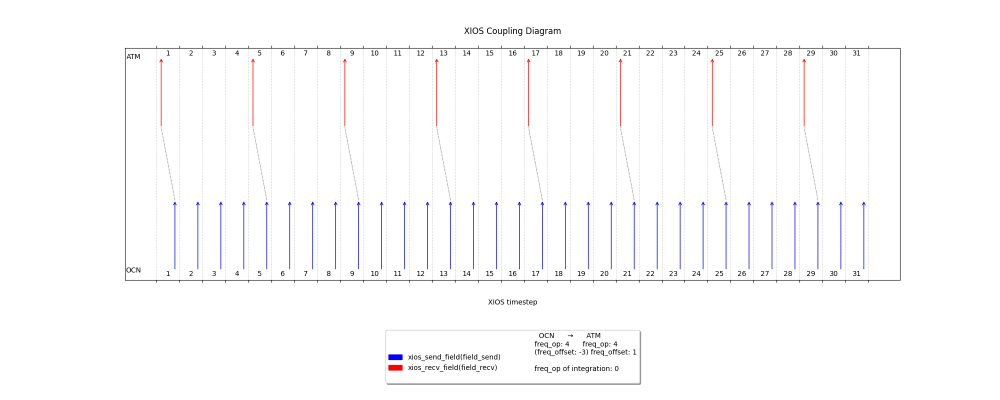

# Monodirectional coupling of a single field with no restart file

In this example, corresponding to the simplest exchange possible in OASIS, we will show how we can perform such kind of exchange.
As we can see from the plot, this is not so straightforward as if there was a "lag". Also, in this configuration, we can only perform an "instant" operation.  
The last field sent is saved as a bonus.

There are implemented two toy models (`ocn` and `atm`). Ocean is the model in charge of sending the field to the Atmosphere model.  


|  | Ocean | Atmosphere|
|----------|----------|----------|
|Start date|Jan 01, 2025|Jan 01, 2025 
| Duration  |  24d       | 24d         |
|Timestep| 1d | 1d
| Send/recv frequency | 4ts     | 4ts         |
This translates to:
| field2D_send.freq_op | 4ts| |
| field2D_send.freq_offset | 0ts | |
| field2D_oce_to_atm.freq_op | 4ts | 4ts |
| field2D_oce_to_atm.freq_offset |  | 1ts |


## Algorithm explaination

We recall that when we say "performing an operation", we mean calculating the result of the operation over the integration period and make that available to the receiver from that moment. 

The problem is that there is no way to perform an operation on the element `@ts=1`, send the result, and then perform the operation on elements `@ts=2,3,4,5` and send that result. 
This comes from the fact that the first operation is done at $@ts=sampling\_ offset + send\_ freq = 0 + send\_ freq$ over the previous integretion period.

We can still tweak the parameters like this so that, if we want to perform a simple exchange between two same timesteps (an "INSTANT" operation), we would need to sample only the necessary element, and then performing the operation instant at the first possible timestep (i.e. after a coupling/integration period). 

We save the last field to file as a bonus.

## Output
```
 OCN: sending field @ts=           1  with value    1.00000000000000     
   ATM: receiving field @ts=           1  with value    1.00000000000000     
 OCN: sending field @ts=           2  with value    2.00000000000000     
 OCN: sending field @ts=           3  with value    3.00000000000000     
 OCN: sending field @ts=           4  with value    4.00000000000000     
   ATM: receiving field @ts=           5  with value    5.00000000000000     
 OCN: sending field @ts=           5  with value    5.00000000000000     
 OCN: sending field @ts=           6  with value    6.00000000000000     
 OCN: sending field @ts=           7  with value    7.00000000000000     
 OCN: sending field @ts=           8  with value    8.00000000000000     
   ATM: receiving field @ts=           9  with value    9.00000000000000     
 OCN: sending field @ts=           9  with value    9.00000000000000     
 OCN: sending field @ts=          10  with value    10.0000000000000     
 OCN: sending field @ts=          11  with value    11.0000000000000     
 OCN: sending field @ts=          12  with value    12.0000000000000     
   ATM: receiving field @ts=          13  with value    13.0000000000000     
 OCN: sending field @ts=          13  with value    13.0000000000000     
 OCN: sending field @ts=          14  with value    14.0000000000000     
 OCN: sending field @ts=          15  with value    15.0000000000000     
 OCN: sending field @ts=          16  with value    16.0000000000000     
   ATM: receiving field @ts=          17  with value    17.0000000000000     
 OCN: sending field @ts=          17  with value    17.0000000000000     
 OCN: sending field @ts=          18  with value    18.0000000000000     
 OCN: sending field @ts=          19  with value    19.0000000000000     
 OCN: sending field @ts=          20  with value    20.0000000000000     
   ATM: receiving field @ts=          21  with value    21.0000000000000     
 OCN: sending field @ts=          21  with value    21.0000000000000     
 OCN: sending field @ts=          22  with value    22.0000000000000     
 OCN: sending field @ts=          23  with value    23.0000000000000     
 OCN: sending field @ts=          24  with value    24.0000000000000  
Server Context destructor
Server Context destructor
```


