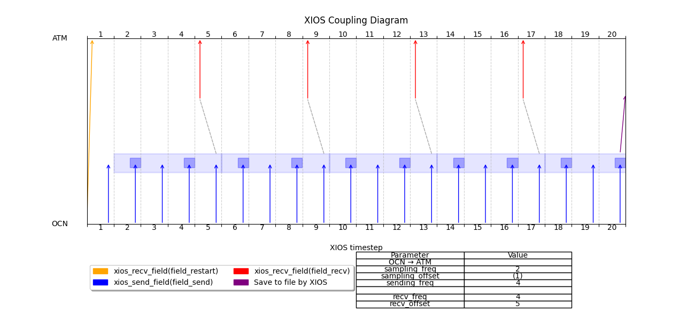

# Monodirectional coupling of a single field with restart file and integration

This example showcases an coupling scheme that includes a time integration on sampled elements over the coupling period.  
The simulation is done over 5 days with exchanges every day (1d = 4ts) of a field that is the result of an operation applied to the sampled elements over a day. Sampled elements refer to the elements that we choose between the one sent by the model for doing an operation with a certain frequency defined in `field2D_send` tag.

|  | Ocean | Atmosphere |
|----------|----------|-------------|
| Start date | Jan 01, 2025 | Jan 01, 2025 |
| Duration   | 5d          | 5d          |
| Timestep   | 6h          | 6h           |
| Coupling frequency | 2ts  | 2ts          |

This translates into the following time parameters for the coupler in and out (no sampling):

### Non-restarting field attributes

| Ocean field attribute      | Value      |
|---------------------------|------------|
| Sampling freq_op          | 2ts |
| Sampling freq_offset      | 1ts          |
| Coupler_out freq_op       | 4ts           |

| Atmosphere field attribute | Value      |
|---------------------------|------------|
| Coupler_in freq_op        | 4ts        |
| Coupler_in freq_offset    | 5ts        |

### Restarting field attributes

| Ocean field attribute      | Value      |
|---------------------------|------------|
| file read output_freq     | (arbitrarily large, so only one output during the run) |
| freq_offset               | 0ts (default in read mode from file) |
| Coupler_out freq_op       | 1y (arbitrarily large, so only one send during the run)   |

| Atmosphere field attribute | Value      |
|---------------------------|------------|
| Coupler_in freq_op        | 1y         |
| Coupler_in freq_offset    | 1ts (to make it available at @ts=1 instead of @ts=0) |



### Note on the plot
Even if the "integration period" isn't exactly aligned to the OASIS one (covering @ts=1,2,3,4), the resulting value sent and received is the coherent with our needs. The operation, indeed, is applied over the those elements in the buffer at the time the operation is applied, which is at @ts=5, and is received at @ts=5 in the atmosphere. The value is coherent with the average of the values sent by the ocean at @ts=2,4, which is 3.0. 

## Algorithm explaination

With this particular configuration, we set as before a field reference for `xios_send_field` named `field2D_send`. Here we are setting three attributes with the following purposes:
- `field2D_send`.`operation`: The operation to apply over an integration period, which is defined in field `field2D_oce_to_atm`
- `field2D_send`.`freq_op`: It is the frequency of **sampling**, to define the elements onto which xios will do the integration
- `field2D_send`.`freq_offset`: The offset to add to `@ts=1` for starting the **sampling** of elements

A so called time filter is triggered when the new flux `field2D_oce_to_atm`, that also acts as an interface for the coupler, defines the following atributes:
- `field2D_oce_to_atm`.`field_ref`: the reference field from which attributes such as the grid are inherited.
- `field2D_oce_to_atm`.`expr`: We refer to `@this_ref` as the the field onto which make the integration operation. The reference is what we have set in `field_ref` 
- `field2D_oce_to_atm`.`freq_op`: It is the frequency at which the operation is applied and at which the result is made available. In the copuler_out, it means that the value is calculated and made available for the coupler in in the receiving context.
- `field2D_oce_to_atm`.`freq_offset`: As discussed before, it refers to offsetting the first timestep at which the operation is applied.

```xml 
<field_definition>
    <!-- sampling frequency, sampling offset and operation to perform here-->
    <field id="field2D_send" grid_ref="grid_2D" freq_op="2ts" freq_offset="1ts" operation="average"/>
</field_definition>

<coupler_out_definition>
    <coupler_out context="atm::atm" >
        <!-- Define the interface for the outgoing field to be received in atmosphere -->
        <!-- sending frequency/operation applied frequency -->
        <field id="field2D_oce_to_atm" field_ref="field2D_send" freq_op="4ts" expr="@this_ref" />
        <!-- Define the interface for the outgoing field loaded from file to be received in atmosphere -->
        <field id="field2D_restart" field_ref="field2D_read"/>
    </coupler_out>
</coupler_out_definition>
```

## Detail on saving the last field
As we see in the file definitions:
```xml

<!-- Save field on file after 5d (The last send, corresponding to the run duration)-->
<!-- Remember to set operation="instant", otherwise it would inherit operation average and perform it over 5 days. Like this, we only pick the last sent value -->
<file id="restart_next" name="restart_next" output_freq="5d" type="one_file" enabled="true" append="false">
    <field field_ref="field2D_oce_to_atm" operation="instant" />
</file>
```
We refer to `field2D_oce_to_atm` to save the last field. `output_freq` behaves like the `freq_offset` attribute in the `coupler_out` by performing the instant operation after 5 days on our already integrated field and saving it to file. No need to set `expr` here. Also `operation="instant"` is set (Otherwise it would perform an average over the 5 days following XIOS time mechanics).  


# Output
```
   ATM: receiving restart field @ts=           1  with value 
  0.000000000000000E+000
 OCN: sending field @ts=           1  with value    1.00000000000000     
 OCN: sending field @ts=           2  with value    2.00000000000000     
 OCN: sending field @ts=           3  with value    3.00000000000000     
 OCN: sending field @ts=           4  with value    4.00000000000000     
   ATM: receiving field @ts=           5  with value    3.00000000000000     
 OCN: sending field @ts=           5  with value    5.00000000000000     
 OCN: sending field @ts=           6  with value    6.00000000000000     
 OCN: sending field @ts=           7  with value    7.00000000000000     
 OCN: sending field @ts=           8  with value    8.00000000000000     
   ATM: receiving field @ts=           9  with value    7.00000000000000     
 OCN: sending field @ts=           9  with value    9.00000000000000     
 OCN: sending field @ts=          10  with value    10.0000000000000     
 OCN: sending field @ts=          11  with value    11.0000000000000     
 OCN: sending field @ts=          12  with value    12.0000000000000     
   ATM: receiving field @ts=          13  with value    11.0000000000000     
 OCN: sending field @ts=          13  with value    13.0000000000000     
 OCN: sending field @ts=          14  with value    14.0000000000000     
 OCN: sending field @ts=          15  with value    15.0000000000000     
 OCN: sending field @ts=          16  with value    16.0000000000000     
   ATM: receiving field @ts=          17  with value    15.0000000000000     
 OCN: sending field @ts=          17  with value    17.0000000000000     
 OCN: sending field @ts=          18  with value    18.0000000000000     
 OCN: sending field @ts=          19  with value    19.0000000000000     
 OCN: sending field @ts=          20  with value    20.0000000000000     
Server Context destructor
Server Context destructor
Server Context destructor
Server Context destructor
```
The output file will contain "19".