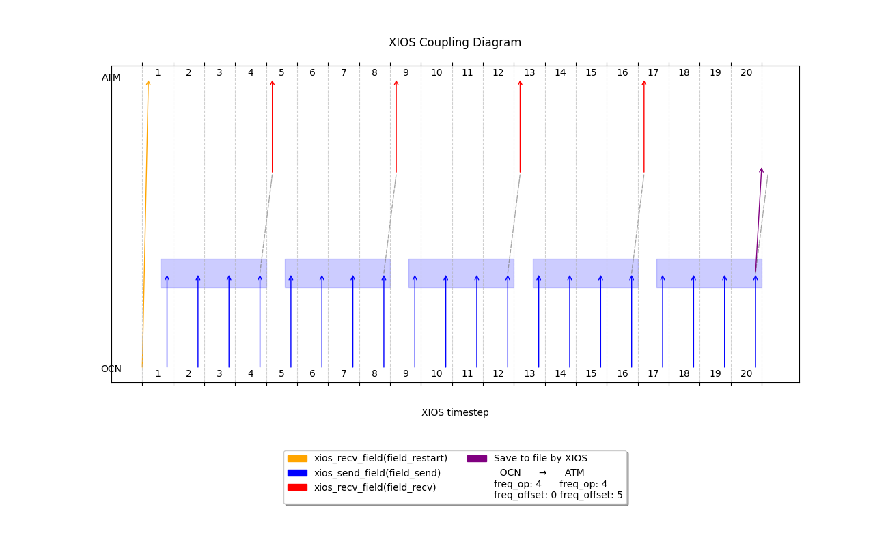

# Monodirectional coupling of a single field with restart file and integration

This examples follows the previous one by enabling the time integration functionality to the coupler. Here our integration operation is `average` instead of `instant`.\
The parameters are the following: 5 days and 4 exchanges every day, with restarting and save file.

|  | Ocean | Atmosphere|
|----------|----------|----------|
|Start date|Jan 01, 2025|Jan 01, 2025 
| Duration  |  5d       | 5d         |
|Timestep| 6h | 6h
| Send/recv frequency          | 4ts          | 4ts         |
This translates to:
| freq_op | 4ts| 4ts
| freq_offset | 0ts | 5ts|
| (Restart field) freq_op | 1y *| 1y*
| (Restart field) freq_offset | 0ts | 1ts|

\* arbitrarily large, so to load one time during the run


## Algorithm explaination
We are exploiting the **time filter** functionality of XIOS. 
As before, the field is sent by the model each timestep and saved in a buffer. We define the operation to perform on this field reference, `field2D_send`.
We enable the time integration adding `expr="@this"` to the other field in the coupler * and it means that we are extracting the value of the operation integrating each `freq_op` timesteps.  

*equivalent to`expr="@field2D_send"` because field_ref already points directly to that field.


```xml 
<!-- Accumulate and average on this field --> 
<field_definition>
  <field_definition>
      <field id="field2D_send" grid_ref="grid_2D" operation="average"/>
  </field_definition>
</field_definition>

<coupler_out_definition>
    <coupler_out context="atm::atm" >
        <field id="field2D_oce_to_atm" field_ref="field2D_send" freq_op="4ts" expr="@this"/>
        ...
        ...
```

## Detail on saving the last field
As we see in the file definitions:
```xml
<!-- Save field on file after 5d (The last send, corresponding to the run duration)-->
<file id="restart_next" name="restart_next" output_freq="5d" type="one_file" enabled="true" append="false">
    <field field_ref="field2D_oce_to_atm" operation="instant"/>
</file>
```
We refer to `field2D_oce_to_atm`. `output_freq` attribute for files enable by itself the time integration, and indeed, even if it's hidden, it is performing the op instant after 5 days on our already integrated field and save it to file.


# Output
```
  ATM: receiving restart field @ts=           1  with value 
0.000000000000000E+000
OCN: sending field @ts=           1  with value    1.00000000000000     
OCN: sending field @ts=           2  with value    2.00000000000000     
OCN: sending field @ts=           3  with value    3.00000000000000     
OCN: sending field @ts=           4  with value    4.00000000000000     
  ATM: receiving field @ts=           5  with value    2.50000000000000     
OCN: sending field @ts=           5  with value    5.00000000000000     
OCN: sending field @ts=           6  with value    6.00000000000000     
OCN: sending field @ts=           7  with value    7.00000000000000     
OCN: sending field @ts=           8  with value    8.00000000000000     
  ATM: receiving field @ts=           9  with value    6.50000000000000     
OCN: sending field @ts=           9  with value    9.00000000000000     
OCN: sending field @ts=          10  with value    10.0000000000000     
OCN: sending field @ts=          11  with value    11.0000000000000     
OCN: sending field @ts=          12  with value    12.0000000000000     
  ATM: receiving field @ts=          13  with value    10.5000000000000     
OCN: sending field @ts=          13  with value    13.0000000000000     
OCN: sending field @ts=          14  with value    14.0000000000000     
OCN: sending field @ts=          15  with value    15.0000000000000     
OCN: sending field @ts=          16  with value    16.0000000000000     
  ATM: receiving field @ts=          17  with value    14.5000000000000     
OCN: sending field @ts=          17  with value    17.0000000000000     
OCN: sending field @ts=          18  with value    18.0000000000000     
OCN: sending field @ts=          19  with value    19.0000000000000     
OCN: sending field @ts=          20  with value    20.0000000000000 
```

