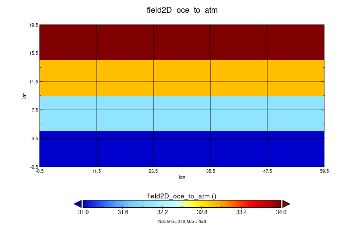

# APPLE partitioning

This is a simple example temporally speaking, where we do an exchange every timestep. We want to focus on the OASIS "Apple" distribution of the field on the source model `ocn` 



# Modifications
During the initialization phase we retrieve the dimensions of the domain from the iodef file, because it's a toymodel environment.
The global size is going to be partitioned by the source toymodel as an Apple partition. 

Note that we are using the `data_` attributes. It results to be more intuitive to work with these attributes in the case of generic non-box partitions in which 
we specify an 1-dimensional array of data given a global starting point and the lenght of it. Refer to XIOS tutorial for a clear understanding of these parameters in general.

We will use this information to calculate the local size of the field to send by each process. 
```fortran
if(model_id == "ocn") then
    config%ni = config%ni_glo
    config%nj = config%nj_glo
    config%ibegin = 0
    config%jbegin = 0

    config%data_dim = 1
    config%data_ni = (config%ni_glo / (size-1))*config%nj_glo ! For example, data splitted eavenly on ocn model processes
    config%data_ibegin = (rank) * config%data_ni

    call xios_set_domain_attr("domain", 
        ni_glo=config%ni_glo, 
        nj_glo=config%nj_glo, 
        type=config%field_type, 
        ni=config%ni, 
        nj=config%nj, 
        ibegin=config%ibegin, 
        jbegin=config%jbegin,
        data_dim=config%data_dim, 
        data_ni=config%data_ni, 
        data_ibegin=config%data_ibegin)
end if 
```
Each process will send a portion of the field, hence we allocate the field as:
```fortran
ALLOCATE(field_send(data_ni, data_nj))
```
which will be sent by the process and gathered by XIOS:
```fortran 
CALL xios_send_field("field2D_send", field_send)
```
