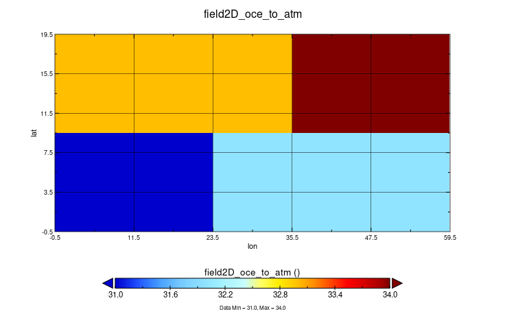

# Monodirectional coupling of a single field with no restart file (Parallel send)

Same scenario as before, but the sending of the field is parallelized on multiple instances of `ocn` following the "Box" paradigm. 



# Modifications

Each `ocn` process wil set the right starting point and local sizes of its subfield. In XIOS, OASIS `global_offset` is replaced by `ibegin` & `jbegin`, while `local_extend_x`/`local_extent_y` with `ni`/`nj`

```fortran
! Upper left corner of the domain
begin_points(0, :) = [0, 0]    ! Rank 0 (ibegin, jbegin)
begin_points(1, :) = [24, 0]
begin_points(2, :) = [0, 10]
begin_points(3, :) = [36, 10] ! Rank 3 (ibegin, jbegin)

! Local domain sizes
nij(0, :) = [24, 10]  ! Rank 0 (ni, nj)
nij(1, :) = [36, 10]
nij(2, :) = [36, 10]
nij(3, :) = [24, 10]


! The distribution of the data is done in the model.
config%ni = nij(rank, 1)
config%nj = nij(rank, 2)
config%ibegin = begin_points(rank, 1)
config%jbegin = begin_points(rank, 2)

call xios_set_domain_attr("domain", ni_glo=config%ni_glo, nj_glo=config%nj_glo, type=config%field_type, ni=config%ni, nj=config%nj, ibegin=config%ibegin, jbegin=config%jbegin)

```
Each process will send a portion of the field, hence we allocate the field as:
```fortran
ALLOCATE(field_send(ni, nj))
```
which will be sent by the process and gathered by XIOS:
```fortran 
CALL xios_send_field("field2D_send", field_send)
```
