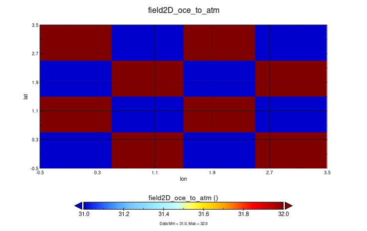

# Monodirectional coupling of a single field with no restart file (Parallel send)

Each process of `ocn` handles irregular patterns of data for which we cannot use `Box` or the `Apple` paradigm. The following approach corresponds to Oasis `Points partition` approach, which can be also generalized to the `Orange` approach. For this example, the data is spread out on 2 processes as a 4x4 checkboard, and so every point index should be mapped.



# Modifications
For more details on the attributes `data_*`, refer to the XIOS training slides. We will use this attribute to define how the data that we send to XIOS from both of `ocn` process should be mapped on the local domain. 

```fortran
config%data_dim = 1 ! Source data is 1D
config%data_ni = 8 ! Length of data 
config%data_ibegin = 0 ! Offset of data wrt ibegin
config%ni = config%ni_glo ! Local partition size
config%nj = config%nj_glo ! Local partition size
config%ibegin = 0 ! Offset of the local partition wrt the global grid
config%jbegin = 0 ! Offset of the local partition wrt the global grid

allocate(config%data_i_index(config%data_ni))

! Checkboard distribution on two processes, 1D data source
IF (rank==0) THEN
    config%data_i_index = [0, 2, 5, 7, 8, 10, 13, 15]
ELSE 
    config%data_i_index = [1, 3, 4, 6, 9, 11, 12, 14]
END IF

call xios_set_domain_attr("domain", ni_glo=config%ni_glo, nj_glo=config%nj_glo, type=config%field_type, ni=config%ni, nj=config%nj, ibegin=config%ibegin, jbegin=config%jbegin, data_dim = config%data_dim, data_ni = config%data_ni, data_ibegin= config%data_ibegin, data_i_index = config%data_i_index)

```
Each process will send a portion of the field, hence we allocate the field as:
```fortran
ALLOCATE(field_send(data_ni))
```
which will be sent by the process and gathered by XIOS:
```fortran 
CALL xios_send_field("field2D_send", field_send)
```
